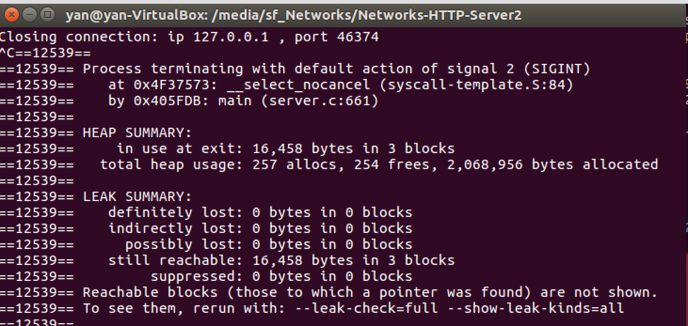

# TESTS
Tests for simple Web server.

## Test HTTP request
Curl is a popular tool to create http requests. We used curl to send http request and test our server response. We can verify the validity of our lisod server response by comparing it with responses from other popular web servers. 

### Test request using curl

Run the following command to check the http response from any well nown host on the internet:  ``` curl -I http://amazon.com ```
```
HTTP/1.1 301 Moved Permanently
Server: Server
Date: Mon, 02 Oct 2017 01:27:38 GMT
Content-Type: text/html
Content-Length: 179
Connection: keep-alive
Location: https://amazon.com/

```

Start the lisod server on port 8080. Now run the following command to send request to liso server : ```  curl -I 127.0.0.1:8080/index.html or curl --head 127.0.0.1:8080/index.html ``` 
```
HTTP/1.1 200 OK
Connection: close
Content-Length: 796
Content-Type: text/html
Date: Mon, 02 Oct 2017 01:32:23 GMT
Last-Modified: Sun, 24 Sep 2017 20:20:01 GMT
Server: Liso/1.0
```

As we can see teh Lisod server response is well formed and resembles response from a standard web server.

Similarly curl can be used to test GET and POST requests.

```
GET : curl 127.0.0.1:8080/index.html
POST: curl -i  --data  "name=nish" 127.0.0.1:8080 
HEAD: curl --head 127.0.0.1:8080/index.html

```


## Memory Leak Check

We used the memcheck tool from Valgrind to detect if there's any memory leaks in our program.
>From Valgrind.org :   

>Valgrind is an instrumentation framework for building dynamic analysis tools. It comes with a set of tools each of which performs some kind of debugging, profiling, or similar task that helps you improve your programs. Valgrind’s architecture is modular, so new tools can be created easily and without disturbing the existing structure.

One of the useful tools provided by Valgring is Memcheck, which is a memory error detector. It helps you make your programs, particularly those written in C and C++, more correct.

#### Installing on Ubuntu
For Ubuntu linux ``` sudo apt-get install valgrind ```

#### Running the test
To test our server code, run:
>valgrind --leak-check=full -v ./lisod <portnumber>

Here's the result we got after running the memory check:

We can see that there appears to be no leaks in our server code. Hooray!
